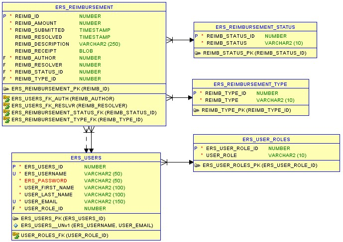

---
# **Foundational Project**
## _Employee Reimbursement System_
---

### Executive Summary
***
"This project is an expense reimbursement system. Employee expense reimbursement software allows you to input expenses for approval through one application. In short, this is an API (Application Programming Interface) for employees to submit reimbursement requests and managers to approve or deny the submitted requests. 

This project will demonstrate an understanding of the fundamentals of software development. It may be expanded upon as desired."

***
### User Stories
***

#### MVP Goals (Core functionality)
1. Ability to log into the application
    - [] Username and password input

2. Ability to register a new account
    - [] Must ensure the username is not already registered
    - [] Default employee role
    
3. Employees can submit reimbursement ticket
    - [] Must have an amount
    - [] Must have a description
    
4. Managers can process tickets submitted by employees
    - [] Tickets can be Approved or Denied
    - [] Tickets cannot change status after processing
    
5. Employees can view previous submissions
    - [] Can filter by Pending, Approved, or Denied status
    

#### Stretch Goals (Additional Functionality)
1. Add Reimbursement Types
    - [] Travel, Lodging, Food, Other
    - [] Employees can view previous requests filtered by type

2. Managers can change other users' roles
    - [] Employee to Manager or back to Employee
    
3. Employees can add images of receipts to their reimbursement requests
    - [] Upload and store images (in SQL or cloud storage)
    
4. User Profile/Account Page
    - [] Track additional user information (name, address, etc.)
    - [] Users can edit their account
    - [] Users can add a profile picture

***
### Flowcharts
***

***
### Technical Requirements
***
You are required to adhere to the following technical stacks:
- Java 8
- Apache Maven
- PostgreSQL (hosted on AWS RDS or localhost)
- Git SCM (hosted on GitHub)
- Postman